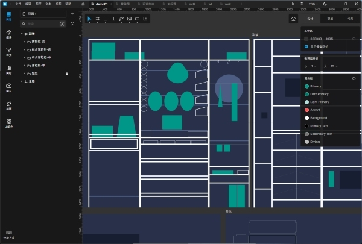
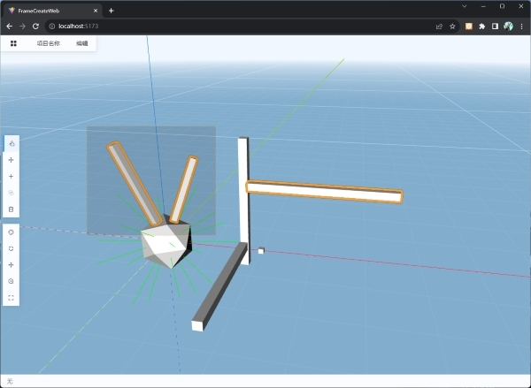
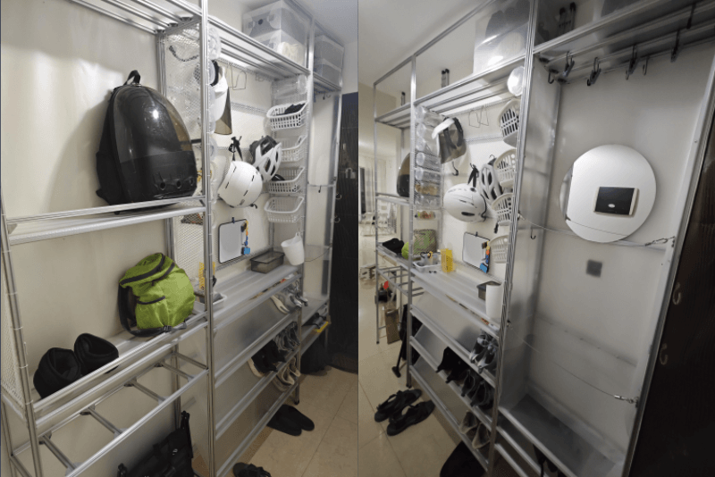

## 1. 简介
这是一个Diy家具的项目，目的是用尽可能低的价格、容易组装的材料，实现好用、美观的家具。

**设计工具：**

目前我使用的是免费的2D设计软件[Luncay](https://igoutu.cn/lunacy)，这个软件是跨平台的。[Luncay英文官网](https://icons8.com/lunacy)

3D设计软件正在开发中。

预览地址：https://kukela.gitee.io/diy-furniture/

**[设计大纲](https://gitee.com/kukela/diy-furniture/blob/master/doc/设计大纲.md)**

**[商品大纲](https://gitee.com/kukela/diy-furniture/blob/master/doc/商品大纲.md)**

## 2. 示例

### 2.1. 玄关柜

通过几个可定制模块化柜子按需实现需要的功能，有拆卸简单，美观方便等特点，适合10~35cm的柜体深度。

**[详情页](https://gitee.com/kukela/diy-furniture/blob/master/example/玄关柜/玄关柜.md)**

**[介绍视频，正在制作中]()**

